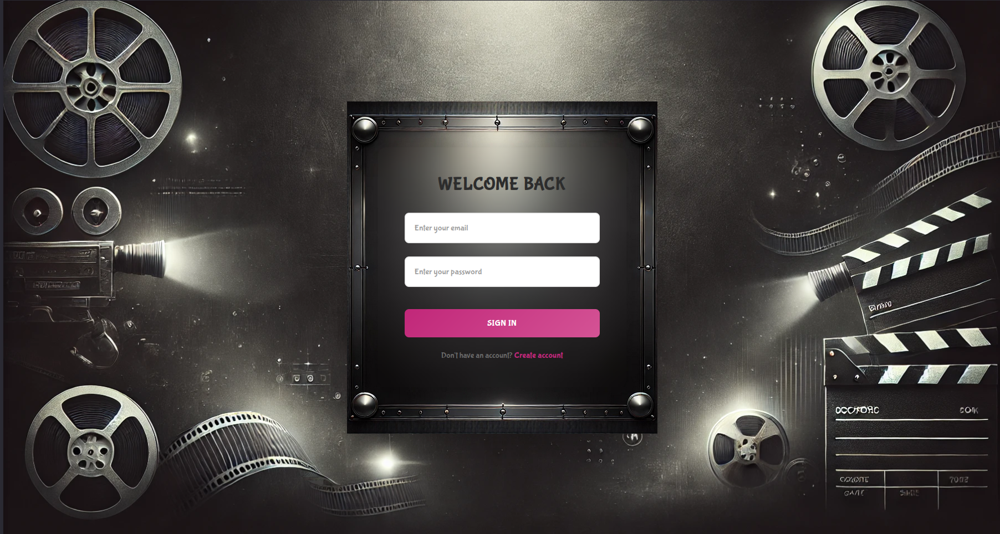
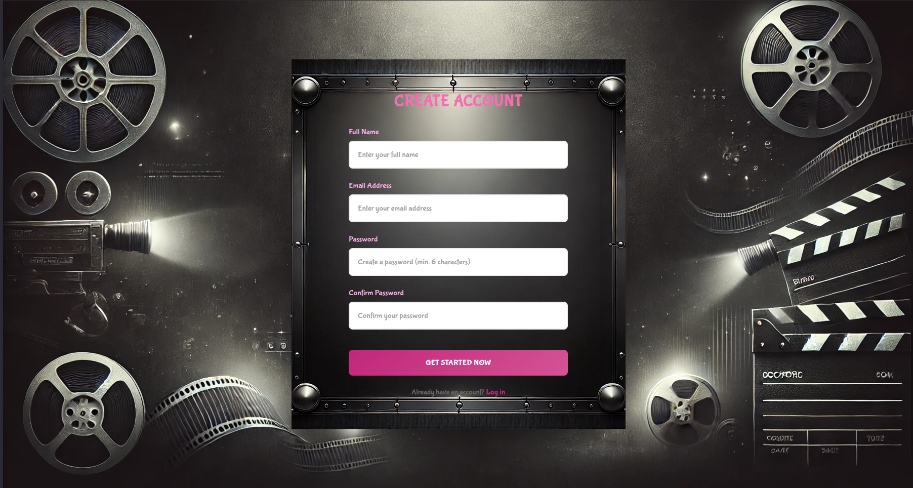
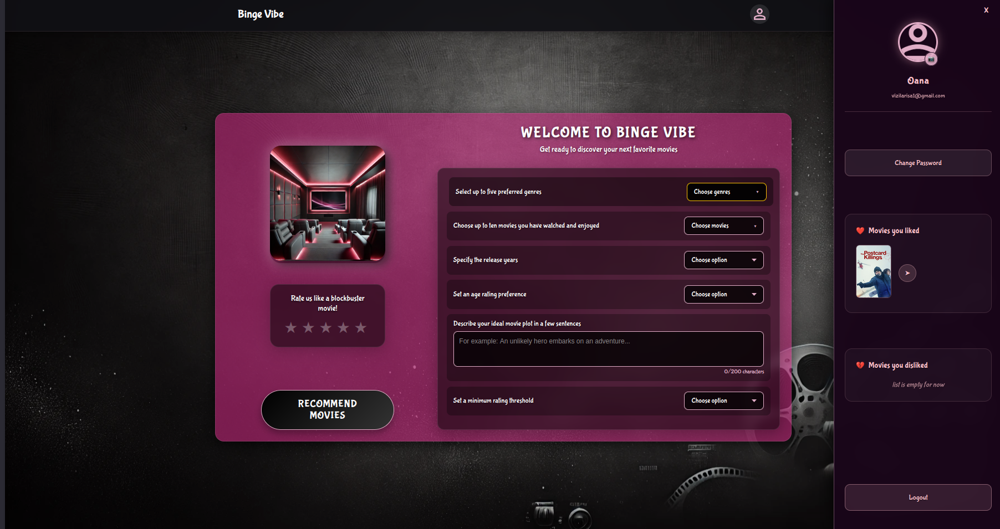
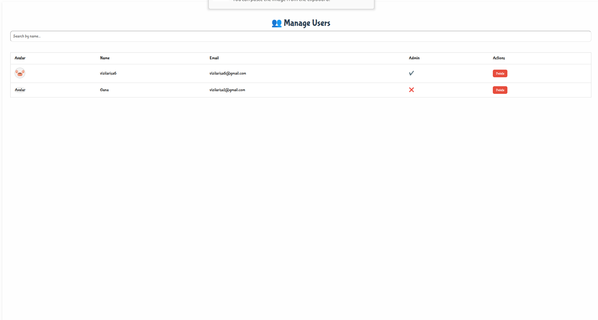
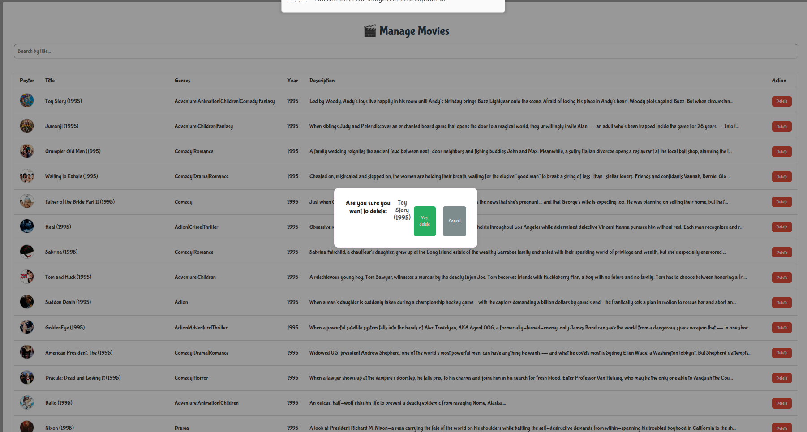

# 🎬 BingeVibe – AI Movie Recommendation System

BingeVibe is a full-stack movie recommendation platform that uses AI-driven techniques to suggest personalized movies based on user preferences, genre interests, and even custom plot descriptions. The system supports both anonymous and authenticated users and includes an admin panel to manage data integrity.

---

## 🚀 Features

- 🔐 **Firebase Authentication** – Secure user login and registration with persistent sessions.
- 🎯 **User Preference Selection** – Users can select favorite genres and liked movies to seed recommendations.
- 🧠 **AI-Powered Recommendations** – Combines BERT (NLP) embeddings with genre filters and user feedback.
- 💬 **Custom Plot-Based Suggestions** – Users can input a story idea and get movie suggestions that match it semantically.
- ❤️ **Like/Dislike System** – Users can express their opinions on each recommendation, which are stored and used to filter future suggestions.
- 🧼 **Data Cleaning & Validation** – Raw MovieLens, IMDb, and TMDb data are cleaned, validated, and enriched.
- 🛠 **Admin Dashboard** – Admins can manage users and dynamically soft-delete movies.
- 💾 **Persistent Feedback** – User feedback is stored in Firestore for later use and personalization.
- 📊 **Data Preprocessing and Schema Enforcement** – Structured and validated datasets are prepared from scratch.

---

## 🧠 How It Works

1. **User Sign Up and Preferences**: Onboarding includes genre selection and picking favorite movies from a filtered list.
2. **BERT-Based Movie Embedding**: Movie descriptions are embedded using `all-MiniLM-L6-v2` to create a semantic space.
3. **FAISS Indexing**: These embeddings are indexed using FAISS for efficient nearest-neighbor search.
4. **Filtering**: Movies are filtered based on user input (genres, age rating, year), and rated movies are excluded.
5. **Recommendation Generation**: A plot-based or hybrid method retrieves similar movies, dynamically skipping those the user has seen.
6. **Feedback Collection**: Likes/dislikes are stored per user and continuously refine the system’s suggestions.
7. **Admin Features**: Admins can log in and delete movies or users through a dedicated dashboard interface.

---

## 🧪 Data & Analysis

This project showcases key data analytics and engineering skills:

- 🧹 **Data Cleaning**: Raw CSVs from MovieLens, IMDb TSVs, and TMDb API responses were joined and cleaned.
- 🔍 **Validation**: Custom scripts validate schema completeness (title, genres, year, rating, description, poster URL).
- 🗃 **Metadata Enrichment**: Movies missing essential fields are excluded. TMDb metadata (description, age rating, posters) is fetched via API and cached.
- 📊 **Exploratory Data Analysis**: Rating distribution, sparsity checks, and age restriction analysis were performed to improve recommendations.
- 🧾 **Schema Enforcement**: Every movie is ensured to have a valid poster, description, genre list, year, and rating before entering the recommendation pipeline.

This structure and process demonstrate foundational data engineering and analytical tasks useful in real-world roles.

---

## 💡 Screenshots

### 🔹 Login Page

### 🔹 Register Page

### 🔹 User Preferences

### 🔹 Recommendations Page

### 🔹 Admin Dashboard





---

## 🔧 Setup Instructions

### 1. Clone the repository
```bash
git clone https://github.com/your-username/bingevibe.git
cd bingevibe
```

### 2. Install backend dependencies
```bash
cd backend
pip install -r requirements.txt
```

### 3. Install frontend dependencies
```bash
cd frontend
npm install
```

### 4. Run the backend (Flask)
```bash
cd backend
python app.py
```

### 5. Run the frontend (React)
```bash
cd frontend
npm start
```

Make sure to set up `.env` for Firebase credentials in the frontend and optionally include your TMDb API key in the backend scripts.

---

## 🗂 Project Structure

```
BACHELORS/
├── backend/
│   ├── app.py                # Flask API backend entrypoint
│   ├── data/                 # Raw and processed movie datasets
│   │   ├── raw/              # Original MovieLens and IMDb files
│   │   └── processed/        # Cleaned and enriched movie data
│   ├── models/               # Recommendation logic (TF-IDF, BERT, hybrid)
│   └── ...                   # Utilities, preprocessing, validation
│
├── frontend/
│   ├── src/
│   │   ├── components/       # Navbar, Sidebar, shared visuals
│   │   ├── pages/            # Main pages: login, preferences, recommendations
│   │   ├── styles/           # CSS files, modals, animations
│   │   └── firebase.js       # Firebase auth and Firestore config
│
├── requirements.txt          # Python dependencies
├── package.json              # Node.js dependencies
└── README.md                 # Project documentation
```

---
